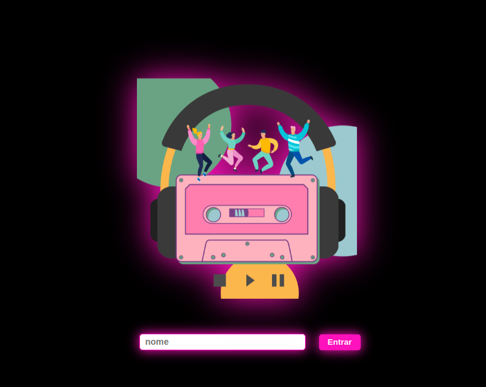
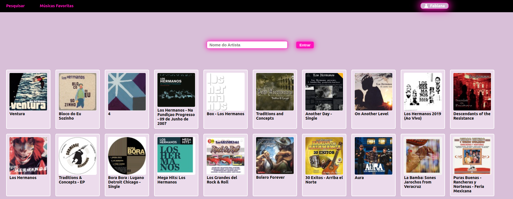

#  Projeto TrybeTunes 🎵 🎧❤️🎧 🎵

  

  
  

 

## :memo: Descrição

Projeto TrybeTunes, aplicação  para reproduzir músicas.

 
## :books: Funcionalidades
* <b>Funcionalidade </b>:  TrybeTunes é uma aplicação capaz de  pesquisar e reproduzir músicas de bandas e artistas diversos 🎧, além de criar uma lista de músicas favoritas ❤️

## :wrench: Tecnologias utilizadas
* JavaScript;
* React;
* HTML;
* CSS;

## :soon: Implementação futura
* tornar a aplicação responsiva
